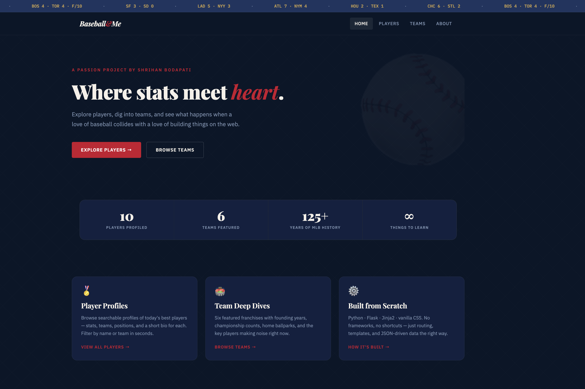

# ⚾ Baseball & Me

A data-driven, multi-page web application built with **Python** and **Flask** — combining a genuine love of baseball with hands-on full-stack development.

> **Live demo:** [baseball-app.onrender.com](https://baseball-app.onrender.com)



---

## What It Does

| Page | Description |
|------|-------------|
| **Home** | Landing page with a live scoreboard ticker, quick stats, and feature cards |
| **Players** | Searchable grid of 10 MLB player profiles with stats, positions, and bios |
| **Teams** | 6 featured franchises with founding year, championship count, ballpark, and key players |
| **About** | Project breakdown — tech stack, learnings, and what's next |

---

## Tech Stack

- **Backend** — Python 3, Flask, Jinja2
- **Frontend** — Vanilla HTML5, CSS3 (custom variables, grid, animations)
- **Data** — Curated JSON files (`data/players.json`, `data/teams.json`)
- **Dev Tools** — Git, GitHub, pip

No JavaScript frameworks. No CSS libraries. Built from scratch.

---

## Features

- **Multi-page routing** — clean URL structure via Flask's `@app.route`
- **Template inheritance** — shared layout with Jinja2 `` and ``
- **Server-side search** — filters players by name or team via `request.args`
- **JSON-driven content** — data separated cleanly from presentation layer
- **Responsive design** — CSS Grid layout adapts to mobile, tablet, and desktop
- **Active nav state** — current page highlighted via `active_page` context variable

---

## Project Structure
```
baseball-app/
├── app.py                  # Flask routes and data helpers
├── requirements.txt        # Dependencies (just Flask)
├── data/
│   ├── players.json        # 10 player records with stats and bios
│   └── teams.json          # 6 franchise records
├── templates/
│   ├── base.html           # Shared layout (header, nav, footer, ticker)
│   ├── index.html          # Home page
│   ├── players.html        # Player search + grid
│   ├── teams.html          # Team cards
│   └── about.html          # Project details
└── static/
    └── style.css           # Full custom stylesheet
```

---

## Run Locally
```bash
# 1. Clone the repo
git clone https://github.com/yourusername/baseball-app.git
cd baseball-app

# 2. Create and activate a virtual environment
python -m venv venv
source venv/bin/activate        # Windows: venv\Scripts\activate

# 3. Install dependencies
pip install -r requirements.txt

# 4. Run the app
python app.py
```

Open [http://localhost:5000](http://localhost:5000) in your browser.

---

## What I Learned

- Flask routing and the request/response cycle
- Jinja2 template inheritance — keeping HTML DRY across pages
- Serving dynamic content from structured JSON data
- URL query parameters for server-side filtering
- CSS custom properties, Grid layout, and keyframe animations
- Git workflow — meaningful commits, `.gitignore`, project structure
- Debugging local Flask development (port conflicts, static file paths, template errors)

---

## Roadmap

- [ ] Individual player detail pages (`/players/<id>`)
- [ ] Integrate MLB Stats API for live data
- [ ] Add team filter to players page
- [ ] Deploy to Render or Railway (public URL)
- [ ] "Did You Know?" trivia section

---

## Author

**Shrihan Bodapati** — Built as a portfolio project to learn Python web development through something I actually care about.

[GitHub](https://github.com/Shrihan245) · [LinkedIn](https://www.linkedin.com/in/shrihan-bodapati)

